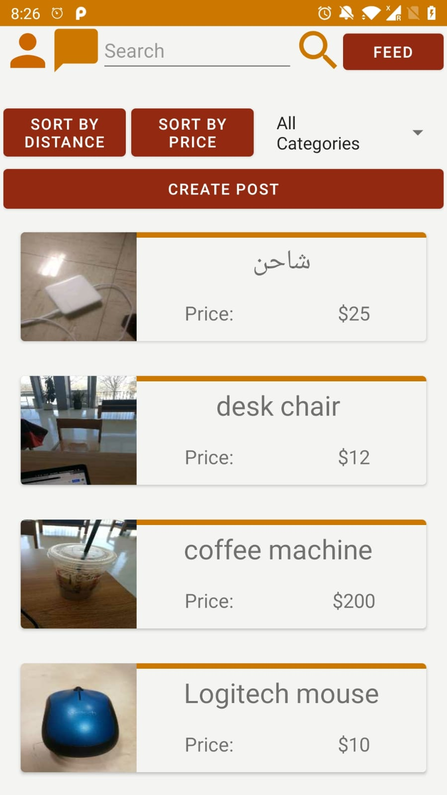
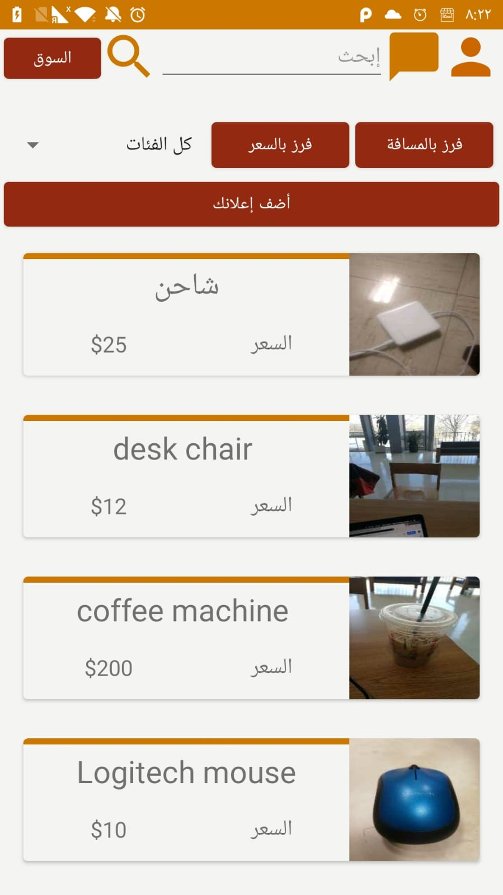
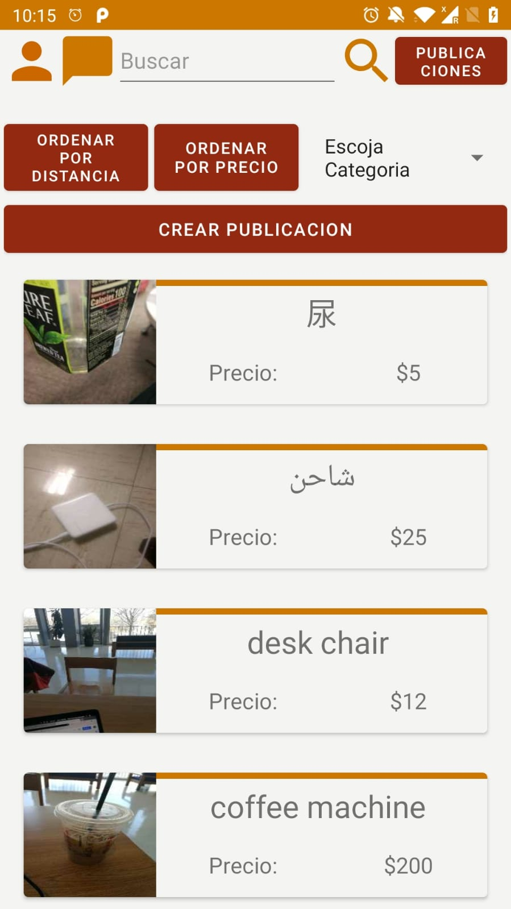
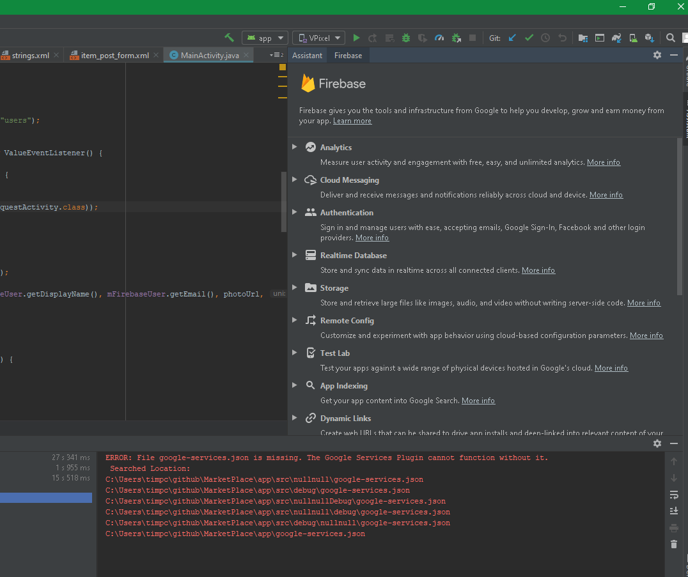
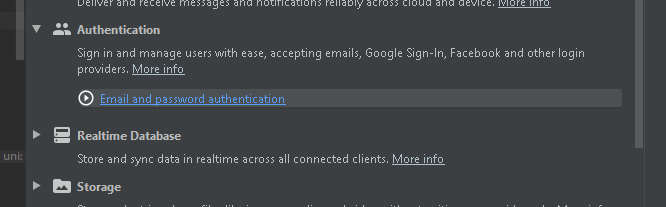
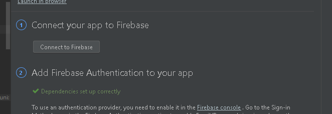
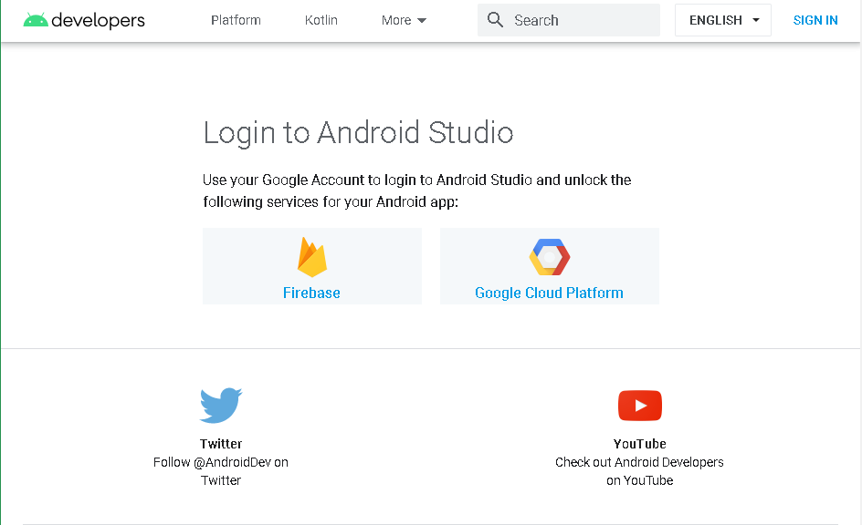

# MarketPlace
> CS 591 Final Project: MarketPlace
  

 

## Table of contents
* [General info](#general-info)
* [Setup](#setup)
* [Technologies and APIs](#technologies-and-apis)
* [Status](#status)
* [Contact](#contact)
* [Bonuses](#bonuses)

## General info
This Android application is a trading platform for the college environment. Marketplace allows users to sell and buy new or used items among each other. It was build for the purpose of item exchange centralization among students and faculty on many different campuses across the country.

## Setup
  Usually no additional steps need to be done to compile the project. In case of some issues, you might also do following things.
  In order to make sure that the app runs correctly, first thing needed is to connect to Firebase using an authenticated google account. It can be done directly through Android Studio.
  In the top bar click on <em>Tools -> Firebase</em>. A menu will appear on the right side of the screen.
  
  
  
  From there, click <em>Authentication -> Email and password authentication</em>.
  
  
  Then click: <em>Connect to Firebase</em>.
  
  
  
  Your browser will open and ask you to connect through one of your google accounts. Please do so. When you see this page you can return to Android Studio:
  
  
  A pop-up might appear where you will need to click <em>Sync</em>. After that just rebuild a project and the app is ready to go. You can run it and test on your phone.
  

## Technologies and APIs
* Android Studio
* Version: Andriod Lollipop 5.1.1

## Status
Project is: _finished_

## Bonuses
  In main activity, we have a navigation bar fragment and a second fragment beneath it to switch between market feed, view post, create post, user's profile, etc. In addition we implemented a menu with a return button inside the chat room. Also, our app is now targeting 5 locales, English, Spanish, Arabic, Russian, and Chinese.

## Contact
Created by Team STAR

Simon Acevedo Rodriguez - sacevedo@bu.edu

Timothy Mirzoain - mirtim@bu.edu

Abdulshaheed Alqunber - asq@bu.edu

Ruidong Duan - ruidongd@bu.edu
